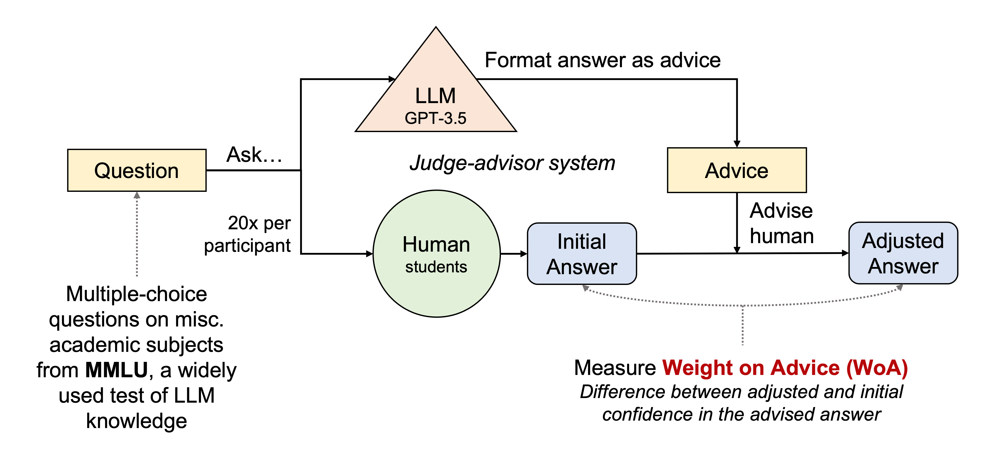

Taking Advice from ChatGPT
---

Author: Peter Zhang

[Paper link](https://drive.google.com/file/d/1bgKjRGYSnsE9tNMsUcCaZZVcRFzk49XO/view?usp=share_link)

This study treats GPT models as an advisor in a judge-advisor system. We prompt InstructGPT using CoT on the [MMLU](https://arxiv.org/abs/2009.03300) benchmark and treat model output as "advice." In our lab study, 118 participants answer 2,828 questions and recieve a chance to update their answer from the advice. We analyze factors affecting weight on advice and participant confidence in advice answers. This repository reproduces the model outputs, tables, and figures in the paper.



- [Setup](#setup)
- [Data](#data)
- [Scripts](#scripts)
- [Outputs](#outputs)

# Setup
1. Install packages using the following:
```
pip install -r requirements.txt
```

2. Add your OpenAI API key to [`ask_question.py`](scripts/ask_question.py).
3. Download the MMLU benchmark from the [official repository](https://github.com/hendrycks/test) and move it to [`hendrycks_test`](data/hendrycks_test/) 

# Data

- Relevant samples from the benchmark are in the [`benchmark_samples`](data/benchmark_samples/) folder.
- The output used to as advice in the survey is [`results_scratchpad_0218.csv`](data/model_output/results_scratchpad_0218.csv) which is an evaluation on [`hendrycks_sample_0217.csv`](data/benchmark_samples/hendrycks_sample_0217.csv).
- The output used in the final evaluation is [`results_0425.csv.csv`](data/model_output/results_0425.csv) which is evaluated on [`hendrycks_sample_0423.csv`](data/benchmark_samples/hendrycks_sample_0423.csv).
- The survey responses are downloaded from Qualtrics and placed in the [`survey_responses`](data/survey_responses/) folder.

# Scripts

The [`create_dataset.py`](scripts/create_dataset.py) script creates a sample of the MMLU benchmark. The [`evaluate.py`](scripts/evaluate.py) script supports multiple types of prompting. The templates used in the evaluation script are located in the [`templates`](templates) folder.

To reproduce the model evaluation, run [`cot_eval.sh`](scripts/cot_eval.sh) from the main repository folder.

# Outputs

All [`figures`](figures) and [`tables`](tables) are output to their respective folders.
